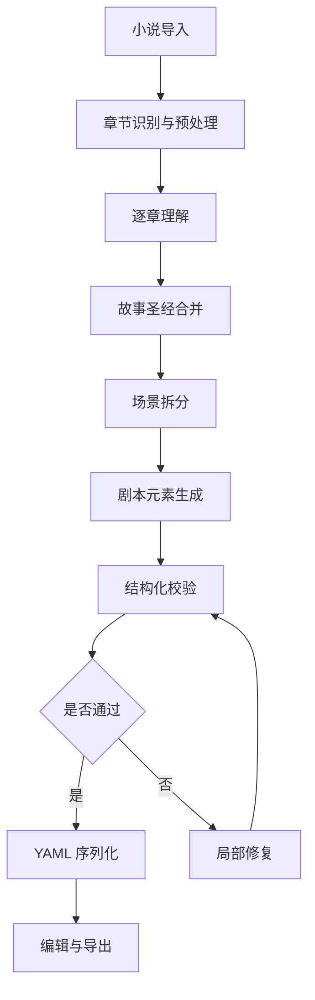
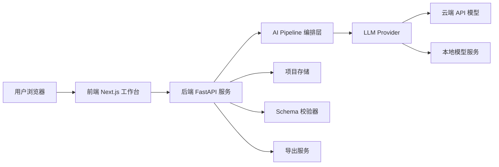

# AI 小说转剧本工具项目设计书

## 1. 项目概述

### 1.1 项目名称

**ScriptBridge AI 小说剧本改编工作台**

### 1.2 选题方向

七牛云 XEngineer 暑期实训营第二批次议题三：

> AI 小说转剧本工具：很多小说作者希望将自己的作品改编成剧本，请开发一款 AI 辅助剧本创作工具，降低改编门槛，提升效率。要求能够将 3 个章节以上的小说文本自动转换为结构化剧本 YAML 格式，让作者可以快速获得可编辑、可进一步打磨的剧本初稿。请额外写一篇文档，定义剧本的 YAML Schema。文档中需说明该 Schema 的设计原因。

### 1.3 一句话定位

ScriptBridge AI 是一个面向小说作者、短剧编剧和内容团队的 AI 剧本改编工作台，能够把多章节小说转成可追踪、可校验、可编辑、可导出的结构化剧本资产。

### 1.4 核心目标

本项目不做简单的“小说输入，YAML 输出”工具，而是构建一套完整的改编工作流：

1. 支持 3 个章节以上小说文本导入。
2. 自动识别章节、人物、地点、剧情节点和冲突线。
3. 生成全局故事圣经，保证人物、地点、时间线一致。
4. 将小说拆解为剧本场景，输出符合 Schema 的 YAML。
5. 支持作者在线编辑场景、对白、动作和 YAML。
6. 实时进行 YAML 语法校验、Schema 校验和引用一致性校验。
7. 支持导出 YAML、Markdown 剧本、Fountain 剧本格式和项目报告。
8. 支持大模型 API 接入，也支持本地模型部署。

### 1.5 产品价值

对小说作者：

- 快速获得剧本初稿，降低从小说到剧本的改编门槛。
- 保留原文来源引用，方便检查 AI 是否误改、漏改或过度发挥。
- 支持局部重写，让作者可以持续打磨对白、场景和节奏。

对评审：

- 作品功能完整，覆盖导入、理解、生成、编辑、校验、导出、演示全链路。
- 架构清晰，具备工程可扩展性。
- Schema-first 设计明显区别于普通 prompt wrapper。
- 支持 API 和本地模型两种大模型接入方式，具备部署弹性。

## 2. 竞赛要求映射

| 竞赛要求 | 本项目对应设计 |
|---|---|
| 能将 3 个章节以上小说文本转换为结构化剧本 | 支持章节识别、章节树、跨章节故事圣经、批量场景生成 |
| 输出 YAML 格式 | 后端使用 Pydantic 定义结构，生成 JSON 后序列化为 YAML |
| 作者可以快速获得可编辑剧本初稿 | 提供场景卡片编辑、YAML 编辑器、剧本预览、局部再生成 |
| 编写 YAML Schema 文档 | 提供 `screenplay.schema.json` 和 `SCHEMA.md` |
| 说明 Schema 设计原因 | 在文档中说明人物、地点、场景、元素、来源追踪等字段设计理由 |
| 作品完整度 | 覆盖导入、分析、生成、校验、编辑、导出、Demo 样例 |
| 开发过程与质量 | 使用模块化架构、类型校验、Schema 校验、测试和清晰 README |
| 演示与表达 | 内置样例项目，一键跑通完整链路，Demo 视频可按固定脚本录制 |

## 3. 用户与使用场景

### 3.1 目标用户

1. 网络小说作者  
   希望把已有小说章节快速转成短剧、广播剧或影视剧本初稿。

2. 短剧编剧  
   需要快速从原文素材中抽取场景、人物和对白，形成可修改的剧本文档。

3. 内容团队  
   需要评估某个小说 IP 是否适合改编，快速得到人物表、场景清单和剧情节奏。

4. 实训评审  
   关注作品是否有完整产品形态、清晰架构、可运行 Demo 和创新点。

### 3.2 典型用户流程

1. 用户进入工作台。
2. 上传或粘贴小说文本，至少 3 个章节。
3. 系统自动识别章节，并展示章节树、字数和 token 估算。
4. 用户点击“开始分析”。
5. 系统逐章提取摘要、人物、地点、事件和冲突。
6. 系统合并生成故事圣经。
7. 系统生成场景大纲。
8. 系统生成结构化剧本 YAML。
9. 用户在场景卡片或 YAML 编辑器中修改内容。
10. 系统实时校验 YAML 和 Schema。
11. 用户局部再生成某个场景或对白。
12. 用户导出 YAML、Markdown 或 Fountain 文件。

## 4. 产品功能设计

### 4.1 功能总览

| 模块 | 功能 | 优先级 | 说明 |
|---|---|---|---|
| 项目管理 | 新建项目、打开项目、保存草稿 | P0 | Demo 可先用浏览器本地存储或后端文件存储 |
| 小说导入 | 粘贴文本、上传 `.txt/.md`、示例文本 | P0 | 必须支持 3 个章节以上 |
| 章节识别 | 自动识别章节标题、顺序、字数 | P0 | 支持“第 X 章”“Chapter X”等常见格式 |
| 文本预处理 | 清洗空行、段落编号、token 估算 | P0 | 为来源追踪和分块处理做准备 |
| 章节分析 | 摘要、事件、人物、地点、情绪变化 | P0 | 生成后续剧本的基础素材 |
| 故事圣经 | 人物表、地点表、关系、时间线 | P0 | 保证跨章节一致性 |
| 场景拆分 | 从小说事件拆成剧本场景 | P0 | 每个场景包含目的、冲突、来源 |
| 剧本生成 | 生成动作、对白、旁白、转场 | P0 | 输出结构化 YAML |
| Schema 校验 | YAML 语法、JSON Schema、引用校验 | P0 | 突出工程质量 |
| 场景编辑 | 卡片编辑人物、地点、对白、动作 | P0 | 提升非技术用户体验 |
| YAML 编辑 | Monaco Editor 编辑 YAML | P0 | 满足题目明确要求 |
| 剧本预览 | 标准剧本样式预览 | P1 | 提升演示效果 |
| 局部再生成 | 只重写选中场景、对白或动作 | P1 | 强化 AI 产品能力 |
| Diff 对比 | 展示再生成前后差异 | P1 | 提升可控性 |
| 导出 | YAML、Markdown、Fountain、JSON | P0 | Fountain 作为亮点 |
| 运行日志 | 展示分析进度和错误原因 | P1 | Demo 可信 |
| 模型设置 | API 模式、本地模式、模型选择 | P1 | 满足部署弹性 |

### 4.2 小说导入模块

#### 功能目标

让用户尽快把小说文本放进系统，并明确知道系统是否满足“3 个章节以上”的要求。

#### 功能细节

1. 支持文本粘贴。
2. 支持上传 `.txt` 和 `.md` 文件。
3. 支持内置样例小说，一键演示。
4. 自动识别章节标题。
5. 展示章节数量、总字数、预计处理时间、预计 token 数。
6. 如果章节少于 3 个，明确提示不满足题目要求。

#### 体验设计

- 上传后立即展示章节树，而不是直接开始生成。
- 每章可展开查看前 300 字预览。
- 用户可以手动修正章节边界。
- 支持“合并短章节”和“拆分长章节”。

#### 技术实现

- 前端读取文件内容。
- 后端或前端使用正则识别章节。
- 常见章节模式：
  - `第[一二三四五六七八九十百千万0-9]+章`
  - `第[一二三四五六七八九十百千万0-9]+节`
  - `Chapter\s+\d+`
  - `CHAPTER\s+\d+`
  - Markdown 标题 `#` 或 `##`

### 4.3 文本预处理模块

#### 功能目标

把原始小说变成后续 AI 工作流可稳定处理的数据结构。

#### 处理内容

1. 清理多余空行和不可见字符。
2. 保留原始段落顺序。
3. 为每个段落生成稳定 ID。
4. 估算每章 token 数。
5. 对长章节进行分块。
6. 建立 `source_ref`，用于回溯原文。

#### 数据示例

```json
{
  "chapter_id": "ch_001",
  "paragraphs": [
    {
      "id": "p_001_001",
      "index": 1,
      "text": "雨夜里，林舟第一次见到那封没有署名的信。",
      "char_start": 0,
      "char_end": 22
    }
  ]
}
```

#### 体验设计

- 分析进度中显示当前处理到第几章。
- 出错时定位到具体章节或段落。
- 用户可以跳过某一章重新分析。

### 4.4 章节分析模块

#### 功能目标

从每章小说中抽取剧本改编所需的基础素材。

#### 输出内容

每章生成：

1. `summary`：章节摘要。
2. `major_events`：主要事件。
3. `characters_mentioned`：出场或被提及人物。
4. `locations_mentioned`：地点。
5. `emotional_arc`：情绪变化。
6. `adaptation_notes`：适合改编为剧本的重点。
7. `candidate_scenes`：候选场景。

#### 体验设计

- 用户可以查看每章分析结果。
- 每个候选场景显示“戏剧价值”标签，例如冲突、反转、情感爆发、信息揭示。
- 用户可以手动禁用某个候选场景，避免生成冗余剧本。

### 4.5 故事圣经模块

#### 功能目标

解决长文本改编中最常见的问题：人物漂移、地点不一致、时间线混乱。

#### 内容结构

1. 人物表
   - 角色 ID
   - 角色姓名
   - 别名
   - 身份
   - 性格
   - 目标
   - 与其他角色关系
   - 首次出现章节

2. 地点表
   - 地点 ID
   - 地点名称
   - 内景/外景倾向
   - 氛围
   - 首次出现章节

3. 时间线
   - 事件 ID
   - 所属章节
   - 时间顺序
   - 事件摘要
   - 影响人物

4. 改编风格
   - 剧本类型：短剧、影视剧、广播剧、舞台剧
   - 节奏：紧凑、文学、悬疑、情绪化
   - 对白风格：自然、克制、网感、戏剧化

#### 体验设计

- 人物和地点用表格展示，可编辑。
- 用户修改人物名称后，全局引用自动更新。
- 标记“核心角色”和“次要角色”。
- 显示可能重复的人物，提供合并建议。

### 4.6 场景拆分模块

#### 功能目标

把小说叙事转换为剧本场景结构。

#### 场景拆分原则

1. 地点变化通常产生新场景。
2. 时间变化通常产生新场景。
3. 人物目标发生变化时可产生新场景。
4. 冲突推进、信息揭示、关系变化是场景存在的理由。
5. 纯心理描写需要转换为动作、对白或可视化场面。

#### 场景字段

- 场景 ID
- 来源章节
- 来源段落
- 场景标题
- 内景/外景
- 地点
- 时间
- 出场人物
- 戏剧目的
- 冲突
- 节拍
- 场景摘要

#### 体验设计

- 场景以卡片列表展示。
- 每张卡片显示：
  - 场景标题
  - 来源章节
  - 人物
  - 地点
  - 冲突标签
  - 校验状态
- 点击场景后左侧高亮对应原文段落。

### 4.7 剧本 YAML 生成模块

#### 功能目标

将场景大纲扩展为完整剧本元素，并输出符合 Schema 的 YAML。

#### 剧本元素类型

1. `action`：动作和画面描述。
2. `dialogue`：角色对白。
3. `parenthetical`：对白括注。
4. `transition`：转场。
5. `voice_over`：旁白。
6. `shot`：镜头提示，可选。
7. `note`：改编说明，仅用于工作台，不一定导出。

#### 生成策略

- 先生成结构化 JSON。
- 用 Pydantic 校验。
- 校验通过后序列化为 YAML。
- 如果校验失败，只让 AI 修复失败字段。
- 不让模型直接输出最终 YAML，避免格式错误。

#### 体验设计

- 生成过程中分阶段展示：
  - 正在分析章节
  - 正在合并人物
  - 正在拆分场景
  - 正在生成对白
  - 正在校验 Schema
- 每个阶段都有成功、失败、可重试状态。

### 4.8 编辑模块

#### 双编辑模式

1. 卡片编辑模式  
   面向普通作者，编辑字段化内容。

2. YAML 编辑模式  
   面向技术用户和评审，直接查看和编辑 YAML。

#### 卡片编辑能力

- 编辑场景标题。
- 修改地点和时间。
- 增删人物。
- 增删动作、对白、转场。
- 调整元素顺序。
- 对单个元素执行 AI 改写。

#### YAML 编辑能力

- Monaco Editor 展示 YAML。
- 支持语法高亮。
- 支持错误行提示。
- 支持 Schema 自动补全。
- 支持格式化。
- 支持从 YAML 同步回场景卡片。

#### 局部再生成

用户可以对以下范围执行 AI 操作：

- 当前场景重写。
- 当前对白润色。
- 当前动作视觉化。
- 将心理描写转为动作。
- 将对白改成更自然、更克制、更紧张等风格。

### 4.9 校验模块

#### 校验类型

1. YAML 语法校验  
   确保文本可解析为对象。

2. JSON Schema 校验  
   确保字段类型、必填字段、枚举值正确。

3. 引用一致性校验  
   确保场景引用的人物和地点已经在故事圣经中定义。

4. 来源追踪校验  
   确保每个场景至少有一个 `source_ref`。

5. 内容完整性校验  
   确保每个场景有标题、地点、时间、人物和至少一个剧本元素。

#### 错误提示设计

错误提示不直接展示复杂技术日志，而是转换成用户能理解的信息：

- “第 3 场引用了不存在的人物 `char_009`。”
- “第 5 场缺少 `dramatic_purpose`，请补充场景目的。”
- “第 2 场没有来源段落，建议重新生成来源追踪。”
- “第 7 场的时间字段只能是 DAY、NIGHT、DUSK、DAWN 或 UNKNOWN。”

#### 一键修复

系统支持三种修复：

1. 程序可修复  
   例如格式化、补充默认值、排序。

2. AI 可修复  
   例如补充场景目的、修正引用 ID。

3. 用户确认修复  
   例如合并重复人物、选择正确地点。

### 4.10 导出模块

#### 导出格式

1. YAML  
   题目要求的核心交付格式。

2. JSON  
   便于程序处理和测试。

3. Markdown  
   便于 README 展示和人工阅读。

4. Fountain  
   标准剧本纯文本格式，体现专业性。

5. 项目包 ZIP  
   包含原文、YAML、Schema、Markdown、Fountain、生成日志。

#### Fountain 导出示例

```fountain
INT. 老宅书房 - NIGHT

雨声敲打窗棂。林舟推开书房门，手里的信已经被攥出折痕。

林舟
你到底想让我知道什么？

窗外一道闪电。书桌上的旧相框映出另一个人的影子。
```

## 5. YAML Schema 设计

### 5.1 设计原则

1. **结构化优先**  
   剧本不是普通长文本，必须拆成项目、故事圣经、章节、场景和剧本元素。

2. **可编辑优先**  
   每个对象都有稳定 ID，便于前端编辑、拖拽、重命名和局部再生成。

3. **可校验优先**  
   使用 JSON Schema 描述 YAML 结构，保障输出稳定。

4. **可追踪优先**  
   场景和元素保留 `source_refs`，方便用户回到小说原文检查。

5. **可扩展优先**  
   `schema_version` 和 `metadata` 支持未来扩展短剧、影视剧、广播剧等格式。

### 5.2 顶层结构

```yaml
schema_version: "1.0"
project:
  id: "proj_001"
  title: "雨夜来信"
  source_language: "zh-CN"
  target_format: "screenplay"
  adaptation_style:
    genre: "悬疑短剧"
    tone: "克制、紧张"
    dialogue_style: "自然"
story_bible:
  characters: []
  locations: []
  timeline: []
chapters: []
scenes: []
metadata:
  generated_at: "2026-06-05T18:00:00+08:00"
  model: "qwen3"
  source_chapter_count: 3
```

### 5.3 核心对象

#### Character

```yaml
id: "char_001"
name: "林舟"
aliases: ["小舟"]
role: "protagonist"
description: "年轻记者，谨慎但执着"
goals:
  - "查清父亲失踪真相"
first_appearance:
  chapter_id: "ch_001"
  paragraph_id: "p_001_001"
relationships:
  - character_id: "char_002"
    type: "mentor"
    description: "曾经帮助过林舟的老编辑"
```

#### Location

```yaml
id: "loc_001"
name: "老宅书房"
type: "interior"
description: "陈旧、潮湿、堆满旧报纸"
first_appearance:
  chapter_id: "ch_001"
  paragraph_id: "p_001_008"
```

#### Scene

```yaml
id: "sc_001"
chapter_ids: ["ch_001"]
source_refs:
  - chapter_id: "ch_001"
    paragraph_ids: ["p_001_001", "p_001_002", "p_001_003"]
heading:
  context: "INT"
  location_id: "loc_001"
  time_of_day: "NIGHT"
title: "林舟发现匿名信"
dramatic_purpose: "引出主线谜团，建立林舟的调查动机"
conflict: "林舟想忽略信件，但信中内容指向父亲失踪"
characters: ["char_001"]
beats:
  - "林舟回到老宅"
  - "发现匿名信"
  - "信件内容暗示父亲仍然活着"
elements:
  - id: "el_001"
    type: "action"
    text: "雨声敲打窗棂。林舟推开书房门，手里的信已经被攥出折痕。"
  - id: "el_002"
    type: "dialogue"
    character_id: "char_001"
    text: "你到底想让我知道什么？"
    emotion: "压抑"
```

### 5.4 字段设计原因

| 字段 | 设计原因 |
|---|---|
| `schema_version` | 支持后续升级，体现工程可维护性 |
| `project` | 记录项目级信息和改编风格 |
| `story_bible` | 保证人物、地点和时间线跨章节一致 |
| `characters.id` | 避免同名、别名和批量重命名问题 |
| `locations.id` | 场景引用地点时保持一致 |
| `chapters` | 保留小说原始章节结构 |
| `source_refs` | 让用户追踪场景来源，降低 AI 幻觉风险 |
| `dramatic_purpose` | 剧本场景必须有戏剧目的，避免流水账 |
| `conflict` | 强制保留冲突，提升剧本质量 |
| `beats` | 表示场景内部节奏，便于二次编辑 |
| `elements` | 用统一数组表达动作、对白、旁白、转场 |
| `metadata` | 记录模型、时间、输入章节数，便于复现 |

## 6. AI 工作流设计

### 6.1 总体策略

采用多阶段 AI Pipeline，而不是单次提示词生成。



### 6.2 阶段一：章节识别

输入：原始文本  
输出：章节列表、段落列表、source refs

技术方式：

- 规则优先。
- 规则失败时，使用 LLM 辅助识别章节边界。
- 用户可手动调整。

### 6.3 阶段二：逐章理解

输入：单章文本  
输出：章节分析 JSON

提示词目标：

- 不生成剧本。
- 只提取事实、事件、人物、地点和候选场景。
- 每个结论必须关联段落 ID。

### 6.4 阶段三：故事圣经合并

输入：所有章节分析结果  
输出：全局人物表、地点表、时间线

关键能力：

- 合并别名。
- 识别同一地点不同叫法。
- 生成角色关系。
- 处理时间顺序。

### 6.5 阶段四：场景拆分

输入：章节分析和故事圣经  
输出：场景大纲

要求：

- 每个场景必须有戏剧目的。
- 每个场景必须有来源段落。
- 场景不宜过碎，避免把每个自然段都变成场景。

### 6.6 阶段五：剧本生成

输入：场景大纲、故事圣经、改编风格  
输出：剧本元素

生成规则：

- 心理描写转为动作、环境或对白。
- 保留关键剧情信息。
- 对白要自然，不照搬大段小说叙述。
- 每个场景至少包含一个动作元素。

### 6.7 阶段六：校验与修复

输入：剧本对象  
输出：通过校验的 YAML

修复策略：

- 如果缺少必填字段，由程序或 AI 补充。
- 如果引用不存在，让 AI 从候选人物或地点中选择。
- 如果 YAML 解析失败，回退到上一版有效对象。
- 修复只作用于错误片段，避免全量重写造成内容漂移。

## 7. 大模型接入方案

### 7.1 接入原则

系统设计为 Provider 抽象，支持 API 和本地模型两种方式。业务层只调用统一接口：

```ts
interface LLMProvider {
  generateStructured<T>(params: {
    schemaName: string;
    input: unknown;
    temperature?: number;
    maxTokens?: number;
  }): Promise<T>;

  rewrite(params: {
    instruction: string;
    context: unknown;
    selection: unknown;
  }): Promise<unknown>;
}
```

### 7.2 API 模式

适用场景：

- 快速开发。
- Demo 稳定。
- 不想处理本地显存和模型部署。

可接入模型：

- OpenAI API。
- DeepSeek API。
- Qwen API。
- 任何 OpenAI-compatible API。

实现方式：

- 后端统一读取 `OPENAI_API_KEY`、`OPENAI_BASE_URL`、`MODEL_NAME`。
- 前端不直接暴露 key。
- 使用结构化输出约束，优先输出 JSON 对象。
- 失败时自动重试 1 到 2 次。

优点：

- 质量稳定。
- 开发速度快。
- 适合 3 天竞赛。

缺点：

- 依赖网络。
- 需要 API key。
- 成本不可完全控制。

### 7.3 本地模型模式

适用场景：

- 演示离线能力。
- 数据隐私要求高。
- 展示工程完整性。

可选方案：

1. Ollama  
   适合个人电脑快速部署。接入简单，OpenAI-compatible 能力逐渐完善。

2. vLLM  
   适合 GPU 服务器，高吞吐，OpenAI-compatible 服务成熟。

3. llama.cpp  
   适合轻量本地运行和量化模型。

推荐本地模型：

- Qwen3 系列，适合中文理解、长文本和创意写作。
- DeepSeek 系列，适合推理和结构化任务。
- Llama 系列，适合英文生态和本地部署。

本地部署接口：

```env
LLM_PROVIDER=local
OPENAI_BASE_URL=http://localhost:11434/v1
MODEL_NAME=qwen3
OPENAI_API_KEY=ollama
```

### 7.4 推荐竞赛配置

最稳配置：

- 默认使用 API 模式，保证 Demo 质量。
- README 提供本地 Ollama 配置作为可选方案。
- 后端 Provider 抽象保留扩展能力。

## 8. 技术架构

### 8.1 总体架构



### 8.2 前端架构

推荐技术：

- Next.js
- React
- TypeScript
- Tailwind CSS
- Zustand
- Monaco Editor
- React Hook Form
- TanStack Query
- Lucide React

前端职责：

- 项目工作台 UI。
- 小说导入和章节预览。
- 场景卡片编辑。
- YAML 编辑。
- 错误面板展示。
- 剧本预览。
- 导出触发。

### 8.3 后端架构

推荐技术：

- FastAPI
- Pydantic
- PyYAML 或 ruamel.yaml
- Instructor
- LangGraph，可选
- Uvicorn
- SQLite，Demo 阶段可选

后端职责：

- 文件和文本接收。
- 文本预处理。
- AI Pipeline 编排。
- Schema 生成和校验。
- YAML 序列化。
- 导出文件生成。
- 模型 Provider 管理。

### 8.4 存储设计

Demo 版本可选两种：

1. 文件存储  
   每个项目一个目录：

```text
data/projects/{project_id}/
  source.txt
  project.json
  screenplay.yaml
  screenplay.fountain
  logs.jsonl
```

2. SQLite  
   保存项目、章节、场景、生成日志和版本。

推荐三天竞赛使用文件存储，简单、可追踪、方便提交。

### 8.5 模块边界

```text
apps/web
  components
  features/import
  features/outline
  features/editor
  features/preview
  features/export

apps/api
  main.py
  models
  schemas
  services
    preprocessing.py
    pipeline.py
    llm_provider.py
    validation.py
    export.py
  prompts
  tests

docs
  SCHEMA.md
  API.md
  DEMO.md
```

## 9. 开源项目选型

### 9.1 核心开源依赖

| 方向 | 项目 | GitHub/官网 | 用途 |
|---|---|---|---|
| 剧本格式 | Fountain | https://fountain.io/syntax/ | 标准剧本纯文本导出格式 |
| 剧本 Schema 参考 | ScreenJSON | https://www.screenjson.com/ | 参考开放剧本结构设计 |
| YAML 编辑器 | Monaco Editor | https://github.com/microsoft/monaco-editor | 浏览器内代码编辑器 |
| YAML 语言服务 | yaml-language-server | https://github.com/redhat-developer/yaml-language-server | YAML Schema 校验、补全、hover |
| 前端 Schema 校验 | Ajv | https://github.com/ajv-validator/ajv | JSON Schema 校验 |
| 后端数据建模 | Pydantic | https://docs.pydantic.dev/latest/concepts/json_schema/ | 定义模型、生成 JSON Schema |
| 结构化 LLM 输出 | Instructor | https://github.com/567-labs/instructor | 让 LLM 输出符合 Pydantic Schema |
| AI 工作流 | LangGraph | https://github.com/langchain-ai/langgraph | 可选，用状态机管理多阶段 AI 流程 |
| 本地模型服务 | Ollama | https://github.com/ollama/ollama | 快速本地部署大模型 |
| 高性能推理 | vLLM | https://github.com/vllm-project/vllm | GPU 服务端部署 OpenAI-compatible API |
| 开源模型 | Qwen3 | https://github.com/QwenLM/Qwen3 | 中文长文本和创意写作模型选择 |
| 小说写作工具参考 | novelWriter | https://github.com/vkbo/novelWriter | 参考章节、元数据、写作项目组织 |
| 创作工作流参考 | NovelForge | https://github.com/RhythmicWave/NovelForge | 参考 Schema-first 和上下文注入思路 |

### 9.2 使用方式说明

本项目主要复用开源项目的能力和接口，不直接复制大型项目代码：

- Monaco Editor 用于编辑器组件。
- yaml-language-server 用于 YAML 智能提示和 Schema 绑定。
- Ajv 用于前端实时 Schema 校验。
- Pydantic 用于后端数据模型。
- Instructor 用于提高 LLM 结构化输出可靠性。
- Fountain 作为导出格式规范。
- ScreenJSON 作为 Schema 设计参考。
- Ollama/vLLM 作为本地模型部署选项。

### 9.3 许可证注意事项

| 项目 | 许可证风险 |
|---|---|
| Monaco Editor | MIT，适合使用 |
| yaml-language-server | MIT，适合使用 |
| Ajv | MIT，适合使用 |
| Pydantic | MIT，适合使用 |
| Instructor | MIT，适合使用 |
| LangGraph | MIT，适合使用 |
| Ollama | MIT，适合使用 |
| vLLM | Apache 2.0，适合使用 |
| Qwen3 | Apache 2.0，适合使用 |
| NovelForge | AGPL-3.0，建议只参考思路，不直接复用代码 |

## 10. UI 设计方案

### 10.1 UI 设计原则

这是一个生产力工作台，不是营销页。界面应当安静、清晰、信息密度适中，重点服务用户完成改编任务。

原则：

1. 熟悉优先  
   使用类似文档编辑器、代码编辑器、项目管理工具的常见布局。

2. 三栏工作台  
   左侧原文和章节，中间场景结构，右侧 YAML/预览/校验。

3. 状态可见  
   生成进度、校验状态、保存状态和错误原因始终可见。

4. 编辑安全  
   AI 修改前后可对比，局部再生成不覆盖全局。

5. 演示友好  
   内置样例和一键生成流程，评审可以快速看到完整能力。

### 10.2 页面结构

```text
顶部栏
  项目名 | 模型状态 | 保存状态 | 导出按钮 | 设置按钮

左侧栏
  导入入口
  章节树
  原文段落
  source_ref 高亮

中间主区
  阶段进度条
  故事圣经 Tab
  场景卡片列表
  场景详情编辑

右侧栏
  YAML 编辑器
  剧本预览
  Schema 错误
  生成日志
```

### 10.3 核心页面

#### 页面一：启动与导入

功能：

- 粘贴小说文本。
- 上传 `.txt/.md`。
- 使用内置样例。
- 设置改编类型和风格。

关键控件：

- 文本输入区。
- 上传按钮。
- 样例按钮。
- 改编风格选择：
  - 短剧
  - 影视剧
  - 广播剧
  - 舞台剧
- 对白风格选择：
  - 自然
  - 克制
  - 网感
  - 戏剧化

体验重点：

- 用户导入后立即看到章节识别结果。
- 不满足 3 章时明确提示。

#### 页面二：分析进度

功能：

- 展示 AI Pipeline 阶段。
- 展示每个阶段状态。
- 支持失败重试。

阶段：

1. 章节识别
2. 段落编号
3. 逐章理解
4. 故事圣经合并
5. 场景拆分
6. 剧本生成
7. Schema 校验

体验重点：

- 不使用空转 spinner。
- 每个阶段显示实际产物数量，例如“识别 3 章，12 个候选场景，6 名人物”。

#### 页面三：改编工作台

布局：

- 左侧：章节和原文。
- 中间：场景卡片。
- 右侧：YAML/预览/错误。

场景卡片字段：

- 场景编号。
- 场景标题。
- 地点和时间。
- 出场人物。
- 戏剧目的。
- 冲突。
- 校验状态。

交互：

- 点击场景，高亮来源段落。
- 拖拽调整场景顺序。
- 点击元素进行编辑。
- 对单个场景执行 AI 重写。

#### 页面四：故事圣经

功能：

- 人物表。
- 地点表。
- 时间线。
- 重复人物合并。
- 全局风格设置。

体验重点：

- 人物表和地点表可直接编辑。
- 修改人物名称后，系统提示是否同步所有引用。

#### 页面五：导出中心

功能：

- 导出 YAML。
- 导出 JSON。
- 导出 Markdown。
- 导出 Fountain。
- 导出项目 ZIP。

体验重点：

- 导出前展示校验状态。
- 如果校验未通过，提示风险但允许导出草稿。

### 10.4 视觉风格

建议风格：

- 背景：浅色工作台。
- 字体：系统字体或 Inter。
- 主色：低饱和蓝或青绿色，仅用于主操作和选中态。
- 状态色：
  - 成功：绿色
  - 警告：琥珀色
  - 错误：红色
  - 信息：蓝色
- 不使用大面积渐变，不使用装饰性卡片堆叠。

### 10.5 组件清单

| 组件 | 用途 |
|---|---|
| AppShell | 顶部栏、侧栏、主工作区 |
| ChapterTree | 章节树 |
| SourceViewer | 原文段落和高亮 |
| PipelineStepper | 生成阶段进度 |
| StoryBibleTable | 人物、地点、时间线表格 |
| SceneCardList | 场景卡片列表 |
| SceneEditor | 场景详情编辑 |
| ElementEditor | 动作、对白、转场元素编辑 |
| YamlEditor | Monaco YAML 编辑器 |
| ValidationPanel | Schema 错误面板 |
| ScriptPreview | 剧本预览 |
| ExportDialog | 导出中心 |
| ModelSettings | 模型配置 |
| DiffViewer | 局部再生成前后对比 |

## 11. API 设计

### 11.1 项目 API

```http
POST /api/projects
GET /api/projects/{project_id}
PATCH /api/projects/{project_id}
DELETE /api/projects/{project_id}
```

### 11.2 导入 API

```http
POST /api/projects/{project_id}/import
POST /api/projects/{project_id}/detect-chapters
```

### 11.3 AI Pipeline API

```http
POST /api/projects/{project_id}/analyze
GET /api/projects/{project_id}/runs/{run_id}
POST /api/projects/{project_id}/runs/{run_id}/retry
```

### 11.4 编辑 API

```http
PATCH /api/projects/{project_id}/story-bible
PATCH /api/projects/{project_id}/scenes/{scene_id}
POST /api/projects/{project_id}/scenes/{scene_id}/rewrite
POST /api/projects/{project_id}/elements/{element_id}/rewrite
```

### 11.5 校验 API

```http
POST /api/projects/{project_id}/validate
POST /api/projects/{project_id}/repair
```

### 11.6 导出 API

```http
GET /api/projects/{project_id}/export/yaml
GET /api/projects/{project_id}/export/json
GET /api/projects/{project_id}/export/markdown
GET /api/projects/{project_id}/export/fountain
GET /api/projects/{project_id}/export/zip
```

## 12. 数据模型

### 12.1 Project

```ts
type Project = {
  id: string;
  title: string;
  status: "draft" | "analyzing" | "ready" | "error";
  sourceText: string;
  createdAt: string;
  updatedAt: string;
  settings: AdaptationSettings;
};
```

### 12.2 Chapter

```ts
type Chapter = {
  id: string;
  order: number;
  title: string;
  text: string;
  paragraphs: SourceParagraph[];
  summary?: string;
};
```

### 12.3 SourceParagraph

```ts
type SourceParagraph = {
  id: string;
  chapterId: string;
  index: number;
  text: string;
  charStart: number;
  charEnd: number;
};
```

### 12.4 Screenplay

```ts
type Screenplay = {
  schemaVersion: string;
  project: ScreenplayProject;
  storyBible: StoryBible;
  chapters: ChapterSummary[];
  scenes: Scene[];
  metadata: GenerationMetadata;
};
```

## 13. 开发计划

### 13.1 三天 MVP 计划

#### 第一天：基础框架和导入分析

目标：

- 搭好前后端项目。
- 完成小说导入、章节识别、段落编号。
- 定义 Pydantic 模型和 JSON Schema。
- 完成第一版提示词。

交付：

- 可以导入 3 章文本。
- 可以看到章节树。
- 可以调用模型得到章节分析。

#### 第二天：剧本生成和校验

目标：

- 完成故事圣经合并。
- 完成场景拆分。
- 完成剧本 YAML 生成。
- 完成 Schema 校验。
- 完成 YAML 编辑器。

交付：

- 可以生成完整 YAML。
- 可以看到校验错误。
- 可以导出 YAML。

#### 第三天：体验打磨和演示

目标：

- 完成场景卡片编辑。
- 完成剧本预览。
- 完成 Fountain/Markdown 导出。
- 完成局部再生成。
- 完成 README、SCHEMA.md 和 Demo 视频脚本。

交付：

- 完整 Demo 链路。
- 可提交代码仓库。
- 可录制演示视频。

### 13.2 优先级控制

必须完成：

- 导入 3 章以上小说。
- 章节识别。
- 结构化 YAML 生成。
- Schema 文档。
- YAML 校验。
- README 和 Demo。

强烈建议完成：

- 故事圣经。
- 场景卡片编辑。
- 源文追踪。
- Markdown/Fountain 导出。

可选增强：

- Diff 对比。
- 局部再生成。
- 多模型切换 UI。
- 项目 ZIP 导出。

## 14. 测试计划

### 14.1 单元测试

| 测试对象 | 测试内容 |
|---|---|
| 章节识别 | 中文章节、英文章节、Markdown 标题 |
| 段落编号 | ID 稳定、空行清理 |
| Schema 校验 | 正确 YAML 通过、错误 YAML 失败 |
| 引用校验 | 未定义人物、未定义地点 |
| Fountain 导出 | 场景标题、对白、动作格式 |

### 14.2 集成测试

1. 导入 3 章样例小说。
2. 执行完整 AI Pipeline。
3. 生成 YAML。
4. 运行 Schema 校验。
5. 修改一个场景。
6. 导出 YAML 和 Markdown。

### 14.3 演示测试

Demo 前必须验证：

- 无 API key 泄露。
- 示例项目可一键跑通。
- 生成失败时有清晰错误。
- 导出文件可打开。
- README 中命令可执行。

## 15. README 结构建议

```md
# ScriptBridge AI

## 项目简介

## 功能亮点

## 技术架构

## 快速开始

## 模型配置

### API 模式

### 本地模型模式

## YAML Schema 说明

## Demo 操作流程

## 开源项目与许可证

## 目录结构

## 后续规划
```

## 16. Demo 视频脚本

### 16.1 视频时长

建议 3 到 5 分钟。

### 16.2 演示顺序

1. 展示题目要求和项目定位。
2. 打开工作台，选择内置三章小说样例。
3. 展示自动章节识别结果。
4. 点击开始生成，展示 Pipeline 阶段。
5. 展示故事圣经：人物、地点、时间线。
6. 展示场景卡片和来源追踪。
7. 切换到 YAML 编辑器，展示符合 Schema 的结构化输出。
8. 故意修改一个错误字段，展示实时校验。
9. 选择一个场景执行局部再生成。
10. 导出 YAML、Markdown 和 Fountain。
11. 总结技术亮点：Schema-first、多阶段生成、来源追踪、API/本地模型双模式。

## 17. 风险与应对

| 风险 | 影响 | 应对 |
|---|---|---|
| 大模型输出不稳定 | YAML 错误、字段缺失 | 使用 Pydantic 结构化输出，失败自动修复 |
| 长文本超出上下文 | 生成失败或遗漏 | 分章处理，先分析再合并 |
| 人物地点不一致 | 剧本质量下降 | 故事圣经统一 ID 和别名 |
| API 不可用 | Demo 中断 | 准备本地模型模式和缓存样例 |
| 生成时间过长 | 体验差 | 内置样例缓存，分阶段展示进度 |
| UI 复杂度过高 | 三天开发压力大 | P0 只做三栏核心工作台，增强功能后置 |
| 开源许可证风险 | 提交风险 | 只直接依赖 MIT/Apache 项目，AGPL 项目只参考思路 |

## 18. 创新点总结

1. Schema-first 剧本生成  
   先定义结构，再让 AI 填充结构，输出更稳定。

2. 多阶段改编 Pipeline  
   从章节理解、故事圣经、场景拆分到剧本生成，避免单 prompt 失控。

3. 来源追踪  
   每个场景可以回到小说原文段落，降低 AI 幻觉风险。

4. 可校验 YAML  
   使用 JSON Schema 和引用校验，让作品具备工程质量。

5. 局部再生成  
   支持只改一个场景或一句对白，而不是全篇重写。

6. API 与本地模型双模式  
   既能快速接入云端模型，也能通过 Ollama/vLLM 本地部署。

7. 标准剧本导出  
   支持 Fountain/Markdown，让生成结果不止停留在 YAML。

## 19. 最终交付物清单

代码仓库应包含：

```text
README.md
SCHEMA.md
screenplay.schema.json
examples/
  sample_novel.md
  sample_output.yaml
  sample_output.fountain
apps/
  web/
  api/
docs/
  DESIGN.md
  DEMO.md
```

提交材料应包含：

- 公开 GitHub/Gitee 仓库地址。
- Demo 视频链接。
- README 文档。
- YAML Schema 文档。
- 示例输入和输出。

## 20. 项目成败标准

### 20.1 最低成功标准

- 能导入 3 章以上小说。
- 能生成结构化 YAML。
- YAML 能通过 Schema 校验。
- README 能说明如何运行。
- Demo 能展示完整链路。

### 20.2 高质量标准

- 有故事圣经和来源追踪。
- 有场景卡片编辑。
- 有实时错误提示。
- 有局部再生成。
- 有 Fountain/Markdown 导出。
- 模型支持 API 和本地部署。

### 20.3 评审表达重点

答辩时应强调：

1. 我们解决的不只是文本生成，而是小说改编的结构化工作流。
2. Schema 让 AI 输出可验证、可编辑、可复用。
3. 来源追踪让作者可以信任和审查 AI 结果。
4. 多阶段 Pipeline 让长文本处理更稳定。
5. API 和本地模型双模式让项目具备真实部署价值。

