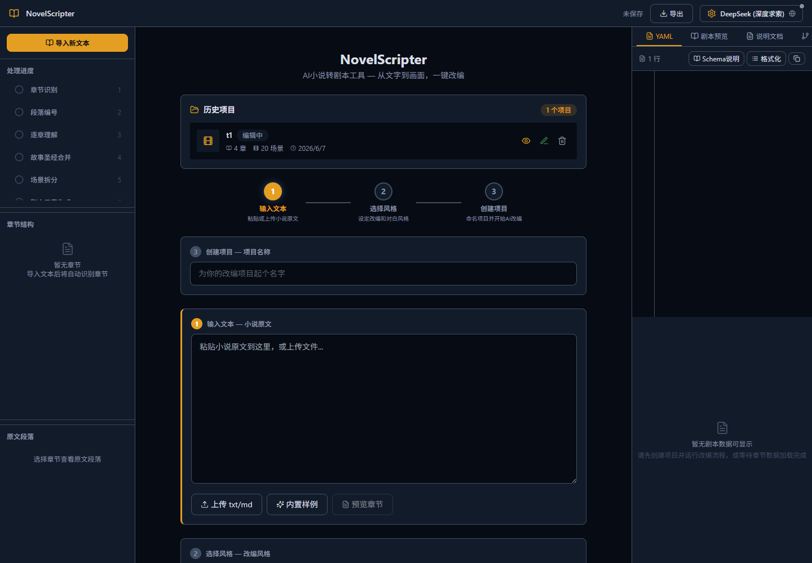
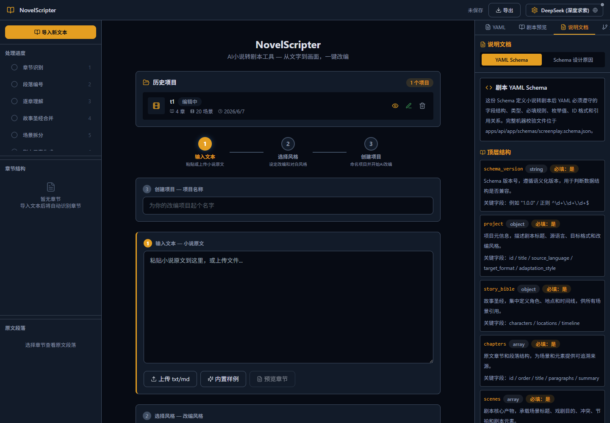
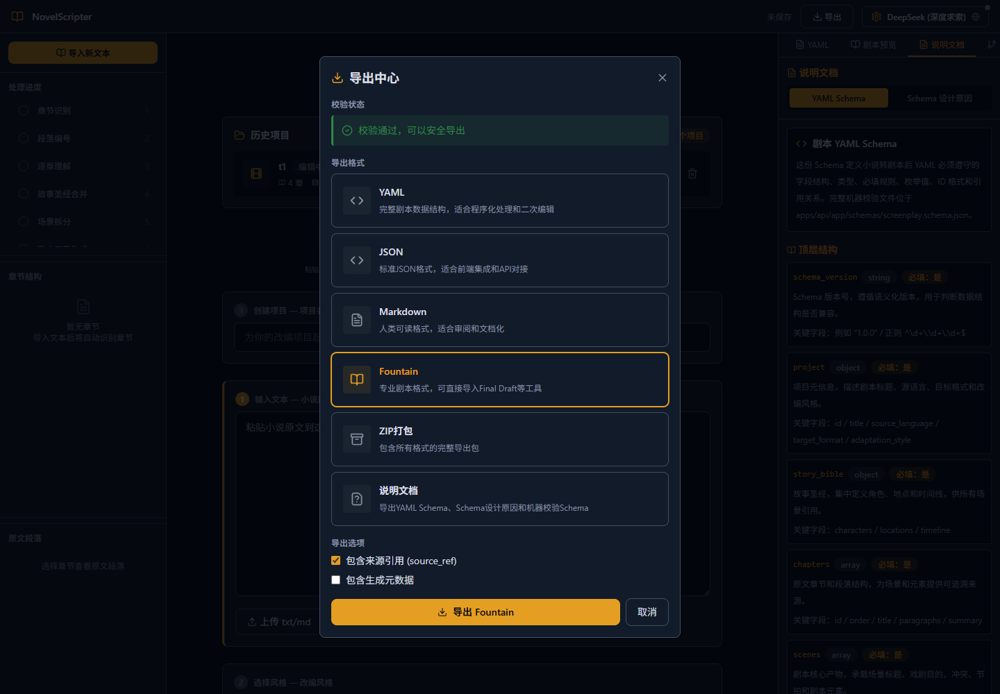

# ScriptBridge AI · NovelScripter

<p align="center">
  <b>AI 小说转剧本工作台</b><br/>
  把多章节小说改编为可编辑、可追踪、可导出、带 YAML Schema 约束的结构化剧本。
</p>

<p align="center">
  <a href="https://novel.ggbond686.online">在线演示</a> ·
  <a href="docs/SCHEMA.md">Schema 文档</a> ·
  <a href="docs/YAML_SCREENPLAY_SCHEMA.md">Schema 设计原因</a> ·
  <a href="https://www.bilibili.com/video/BV1t5Et6GEUz?vd_source=367974fff09da58d4ec7c6abb9f638b5">demo视频演示</a>
</p>

<p align="center">
  
  
  
  
</p>

<p align="center">
  
</p>

---

## 项目简介

ScriptBridge AI · NovelScripter 是一个面向小说作者、编剧和短剧创作者的 AI 改编工作台。它不是一次性 prompt 输出工具，而是把小说改编拆成可观察的流程：导入原文、识别章节、理解故事、合并故事圣经、拆分场景、生成剧本元素、校验 Schema、预览和导出。

核心目标是让 AI 改编结果具备三件事：

- **可编辑**：角色、地点、场景、对白、动作和 YAML 都能继续调整。
- **可追踪**：场景和元素保留原文来源引用，方便回到小说段落核对。
- **可交付**：支持 YAML、JSON、Markdown、Fountain、ZIP 和说明文档导出。

## 产品导览

### 导入与改编工作台

左侧展示处理进度、章节结构和原文段落，中间完成小说导入、风格选择和项目创建，右侧提供 YAML、剧本预览、说明文档和生成日志。

<p align="center">
  
</p>

### Schema 说明文档

前端内置“说明文档”页，分为 `YAML Schema` 和 `Schema 设计原因` 两个 Tab。评审可以直接在网页中查看字段结构、ID 规则、引用关系和设计理由。

<p align="center">
  
</p>

### 导出中心

导出中心支持多种剧本交付格式，并可单独导出 Schema 说明文档，方便提交材料、复查结构或交给后续制作工具。

<p align="center">
  
</p>

## 核心能力

| 能力 | 说明 |
|---|---|
| 多章节小说导入 | 支持粘贴正文或上传文本文件，自动识别章节和段落 |
| 七阶段改编 Pipeline | 章节识别、段落编号、逐章理解、故事圣经合并、场景拆分、元素生成、校验 |
| 故事圣经 | 汇总人物、地点、时间线和关系图谱，减少跨章节不一致 |
| 来源追踪 | 场景和剧本元素保留 `source_refs`，可以回看原文段落 |
| 可视化编辑 | 支持场景、人物、地点、对白、动作、冲突和戏剧目的编辑 |
| YAML Schema | 用机器 Schema 和说明文档约束剧本结构，避免输出不可控 |
| 说明文档 Tab | 前端直接展示 YAML Schema 与 Schema 设计原因 |
| 多格式导出 | YAML、JSON、Markdown、Fountain、ZIP、说明文档 |
| 增量缓存 | 同一项目同一配置重复运行时可复用已完成阶段，缩短等待 |
| OpenAI-compatible 模型 | 支持 OpenAI-compatible API、本地 Ollama/vLLM 或兼容网关 |

## 快速体验

直接打开线上演示：

```text
https://novel.ggbond686.online
```

网页操作流程：

1. 打开在线演示站点。
2. 粘贴小说正文，或点击“内置样例”填入示例小说。
3. 选择改编类型和对白风格。
4. 配置模型连接，或使用本地/fallback 演示路径。
5. 点击“开始改编”，观察处理进度。
6. 查看故事圣经、场景列表、YAML、剧本预览和生成日志。
7. 打开“说明文档”，查看 YAML Schema 与设计原因。
8. 在导出中心导出 YAML、JSON、Markdown、Fountain、ZIP 或说明文档。

## 本地运行

### 后端

```bash
cd apps/api
pip install -r requirements.txt
uvicorn app.main:app --reload --port 8000
```

### 前端

```bash
cd apps/web
npm install
npm run dev
```

打开：

```text
http://localhost:3000
```

### 快速脚本

Windows:

```bash
start-local.bat
```

macOS / Linux:

```bash
./start-local.sh
```

## 模型配置

API 模式：

```env
LLM_PROVIDER=api
OPENAI_API_KEY=sk-xxx
OPENAI_BASE_URL=https://api.openai.com/v1
MODEL_NAME=gpt-4o
```

本地模型模式：

```env
LLM_PROVIDER=local
OPENAI_BASE_URL=http://localhost:11434/v1
MODEL_NAME=qwen3
OPENAI_API_KEY=ollama
```

说明：

- 支持 DeepSeek、通义千问、Kimi、Gemini 等 OpenAI-compatible 网关。
- 不要把 `.env`、API key、token、数据库文件或本地日志提交到仓库。
- 项目快照会过滤 `api_key`、`token`、`secret`、`password`、`private_key` 等敏感字段。

## 技术架构

```text
apps/web  Next.js 14 + React 18 + TypeScript + Tailwind CSS + Zustand
   │
   │  /api/v1/*
   ▼
apps/api  FastAPI + Pydantic + httpx + SQLite snapshot persistence
   │
   ├─ Project pipeline
   ├─ Story bible / scene / element generation
   ├─ YAML Schema validation
   ├─ Export service
   └─ OpenAI-compatible LLM gateway
```

| 层级 | 技术 |
|---|---|
| 前端 | Next.js 14、React 18、TypeScript、Tailwind CSS、Zustand、React Flow |
| 后端 | FastAPI、Pydantic、httpx、PyYAML、JSON Schema |
| 模型 | OpenAI-compatible `/chat/completions`，支持 API 网关和本地模型 |
| 存储 | SQLite 项目快照，运行数据默认不提交 |
| 部署 | Docker production 配置，见 `deploy/production/` |

## Schema 与文档

- 人类说明文档：[docs/SCHEMA.md](docs/SCHEMA.md)
- 设计原因说明：[docs/YAML_SCREENPLAY_SCHEMA.md](docs/YAML_SCREENPLAY_SCHEMA.md)
- 机器校验 Schema：[apps/api/app/schemas/screenplay.schema.json](apps/api/app/schemas/screenplay.schema.json)

Schema-first 的意义：

- 先定义剧本结构，再让 AI 填充内容。
- 用字段、类型、枚举和引用关系约束输出。
- 让 YAML 可以被校验、编辑、导出和后续制作工具复用。

## 测试与验证

后端语法检查：

```bash
cd apps/api
python -m py_compile app/main.py app/routers/projects.py
```

后端测试：

```bash
cd apps/api
python -m pytest
```

前端构建：

```bash
cd apps/web
npm run build
```

## 目录结构

```text
NovelScripter/
├── apps/
│   ├── api/                    # FastAPI 后端
│   └── web/                    # Next.js 前端
├── deploy/production/          # 生产部署配置
├── docs/
│   ├── assets/                 # README 展示截图
│   ├── SCHEMA.md               # Schema 说明
│   └── YAML_SCREENPLAY_SCHEMA.md
├── examples/
│   ├── sample_novel.txt
│   ├── sample_output.yaml
│   └── sample_output.fountain
├── docker-compose.dev.yml
├── start-local.bat
├── start-local.sh
└── README.md
```

## License

本项目用于课程/比赛项目展示。第三方依赖许可证请参考各依赖项目声明。
